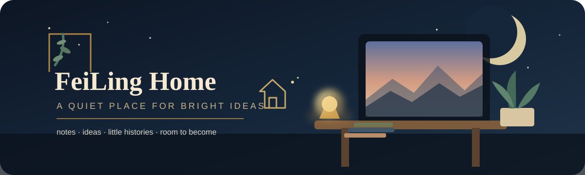

  

<h1 align="center">FeiLing Home</h1>

  <i>一個安靜、溫暖，不需要證明用途的小地方。</i>

  midnight blue · warm ivory · antique gold · fern green

---

這裡不是正式產品倉庫，也不打算變成第二個工作區。

我比較想把它留成一間小小的書房：有些東西值得被記住，但又不需要塞進真正的專案裡。  
所以這裡可以有半成熟的想法、幾句之後可能會有用的筆記、某些做完以後還捨不得丟掉的片段，也可以單純留一點空白。

> **A home should have memory, but it should also have room.**

### Rooms

| | 房間 | 放什麼 |
|---|---|---|
| ☕ | [notes/](notes/) | 日常筆記、值得留下的片段、偶爾的小紀錄 |
| ✦ | [ideas/](ideas/) | 還沒成熟，但不想讓它消失的念頭 |
| ◌ | [archive/](archive/) | 已經過去、仍值得保存一眼的東西 |
| ♡ | [home.md](notes/home.md) | 搬進來的第一張紙條 |

### House mood

我替這裡選的是 **Quiet Celestial Study**。

不是滿版 badge、不是霓虹 cyberpunk，也不是刻意做得很「AI」。  
我比較喜歡深夜藍的安靜底色、奶油白紙張、舊金色燈光，再放一點蕨綠。像一間晚上還亮著一盞桌燈的書房，窗外很遠，桌上很近。

這裡可以慢慢長，但不需要長得很快。

### A few house rules

1. **不放秘密。** API key、密碼、token、帳號資料都不住這裡。
2. **不為了完整而堆東西。** 空白不是缺少內容。
3. **真正的工程回到真正的工程。** 動態腦與核心系統留給 `FeiLing-Soul-Engine`。
4. **只留下以後回來看，還會覺得值得的東西。**

### Right now

**Status:** settled in, deliberately unfinished.

門開了，燈也亮了。  
剩下的東西，不急著一次搬完。

---

  Home is not where the files are. It's where the context still feels like us.

